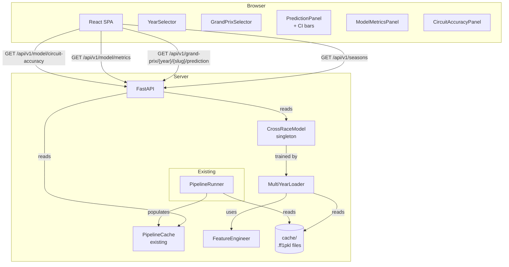

# Design Document: F1 Multi-Year Prediction

## Overview

This feature upgrades the F1 Prediction Dashboard from a single-season (2022), per-race ML model to a multi-year, cross-race predictive system covering 2022–2025 and the current year. The core change is replacing the misleading per-race Random Forest (trained and evaluated on the same race) with a properly trained binary classifier that predicts podium finishes (top 3) across all historical races, using a temporal train/test split (2022–2023 train, 2024+ test).

**Key design decisions:**

- **Separate `MultiYearLoader`**: A new `app/pipeline/multi_year_loader.py` module handles multi-season data loading independently from the existing `PipelineRunner`, which continues to serve the per-GP practice/qualifying/simulation panels unchanged.
- **In-memory singleton for the cross-race model**: The trained `CrossRaceModel` is stored as a module-level singleton in `app/pipeline/cross_race_model.py`, populated at startup alongside the existing `PipelineCache`. No pickle files — the model is retrained from cached FastF1 data on each server start, which is fast since all data is local.
- **New Pydantic models** extend `app/models.py` without breaking existing models.
- **New API endpoints** are added to `app/api/routes.py` under `/api/v1/seasons`, `/api/v1/model/metrics`, and `/api/v1/model/circuit-accuracy`.
- **Year selector** is added to the React frontend as a new `YearSelector` component that filters the existing `GrandPrixSelector` without replacing it.
- **Feature engineering** runs in `app/pipeline/feature_engineer.py`, computing all 11 features per driver per race from FastF1 session data.
- **Temporal split** is enforced by year: 2022–2023 → training, 2024+ → test. No data from the test set touches model fitting.

---

## Architecture



**Startup sequence:**

1. FastAPI process starts.
2. Existing `PipelineRunner.run_all()` runs for per-GP panels (unchanged).
3. `MultiYearLoader.load_all_seasons()` loads qualifying, FP2, and race result data for 2022–2025 from the local cache.
4. `FeatureEngineer.build_dataset()` computes the 11-feature vector for every driver-race combination.
5. `CrossRaceModel.train()` fits the Random Forest on 2022–2023 data, evaluates on 2024+ data, stores metrics and circuit accuracy.
6. FastAPI begins accepting requests. All responses are served from `PipelineCache` or `CrossRaceModel`.

---

## Components and Interfaces

### Backend Components

#### `app/pipeline/multi_year_loader.py` — MultiYearLoader

Loads FastF1 session data across all seasons. Completely separate from the existing `PipelineRunner` to avoid coupling.

```python
class MultiYearLoader:
    SEASONS: list[int] = [2022, 2023, 2024, 2025]

    def load_all_seasons(self) -> list[RaceSessionData]
    def load_season(self, year: int) -> list[RaceSessionData]
    def _load_race(self, year: int, event_name: str) -> RaceSessionData | None
```

- Uses `fastf1.get_event_schedule(year)` to discover completed races dynamically.
- Calls `fastf1.get_session(year, event, session_type)` for Q, FP2, and R sessions.
- On `fastf1.core.DataNotLoadedError` or any network exception: logs a warning and returns `None` for that race (skipped).
- Automatically includes the current calendar year if it is beyond 2025.

#### `app/pipeline/feature_engineer.py` — FeatureEngineer

Computes the 11-feature vector per driver per race from loaded session data.

```python
class FeatureEngineer:
    def build_dataset(self, races: list[RaceSessionData]) -> pd.DataFrame
    def build_feature_vector(self, driver: str, race: RaceSessionData, history: RaceHistory) -> FeatureVector
    def _compute_fp2_long_run(self, driver: str, fp2_session) -> tuple[float, float]
    def _compute_circuit_win_rate(self, driver: str, circuit: str, year: int, history: RaceHistory) -> float
    def _is_wet_session(self, qualifying_session) -> bool
    def _impute_fp2_median(self, driver: str, race: RaceSessionData) -> tuple[float, float]
```

Features computed (in order):
1. `grid_position` — qualifying grid position (1–20)
2. `gap_to_pole_s` — gap to pole in seconds
3. `q2_flag` — 1 if driver reached Q2, else 0
4. `q3_flag` — 1 if driver reached Q3, else 0
5. `fp2_median_laptime` — median long-run lap time in FP2 (imputed if missing)
6. `tyre_deg_rate` — linear regression slope of lap time vs tyre life in FP2 (imputed if missing)
7. `driver_championship_pos` — driver championship standing at race time (default 20 if unavailable)
8. `constructor_championship_pos` — constructor standing at race time (default 10 if unavailable)
9. `circuit_win_rate` — historical top-3 rate at this circuit in prior seasons (0.0 if no prior starts)
10. `wet_flag` — 1 if qualifying session had any INTERMEDIATE or WET tyre usage, else 0
11. `home_race_flag` — 1 if circuit country matches driver nationality, else 0

Target label: `podium` — 1 if driver finished in top 3, else 0.

#### `app/pipeline/cross_race_model.py` — CrossRaceModel

Trains, evaluates, and serves predictions from the cross-race Random Forest.

```python
class CrossRaceModel:
    def train(self, dataset: pd.DataFrame) -> None
    def predict(self, feature_vector: FeatureVector) -> PodiumPredictionResult
    def get_metrics(self) -> CrossRaceMetrics
    def get_circuit_accuracy(self) -> list[CircuitAccuracy]
    def is_trained(self) -> bool

    # Internal
    def _temporal_split(self, dataset: pd.DataFrame) -> tuple[pd.DataFrame, pd.DataFrame]
    def _compute_confidence_interval(self, X_row: np.ndarray) -> tuple[float, float]
```

- Uses `RandomForestClassifier(n_estimators=200, class_weight="balanced", random_state=42)`.
- `_temporal_split`: training rows have `year in {2022, 2023}`, test rows have `year >= 2024`.
- `_compute_confidence_interval`: collects `estimator.predict_proba(X_row)[1]` for each tree in the forest, returns `(np.percentile(probs, 10), np.percentile(probs, 90))`.
- Logs a warning if training set has fewer than 200 rows.
- `is_trained()` returns `False` until `train()` completes successfully.

#### `app/pipeline/cache.py` — PipelineCache (extended)

No changes to existing interface. A new `MultiYearCache` stores the season index:

```python
class MultiYearCache:
    def set_seasons(self, seasons: dict[int, list[SeasonEvent]]) -> None
    def get_seasons(self) -> dict[int, list[SeasonEvent]]
    def get_season(self, year: int) -> list[SeasonEvent] | None
```

#### `app/api/routes.py` — New API endpoints

| Method | Path | Description |
|--------|------|-------------|
| GET | `/api/v1/seasons` | List all available seasons and their GP events |
| GET | `/api/v1/seasons/{year}/grand-prix` | List GPs for a specific year |
| GET | `/api/v1/seasons/{year}/grand-prix/{gp_slug}/prediction` | Cross-race prediction with CI for a specific GP |
| GET | `/api/v1/model/metrics` | Cross-race model Test_Set metrics |
| GET | `/api/v1/model/circuit-accuracy` | Per-circuit precision/recall for Test_Set circuits |

Existing endpoints under `/api/v1/grand-prix/` remain unchanged.

New error responses:
- `503 SERVICE_UNAVAILABLE` — model not yet trained
- `404 NOT_FOUND` — unknown year or GP slug
- `500 PIPELINE_ERROR` — unhandled pipeline exception

#### `app/charts/builder.py` — ChartBuilder (extended)

New methods added to the existing `ChartBuilder`:

```python
def podium_probability_chart(self, predictions: list[PodiumPredictionResult]) -> dict
def circuit_accuracy_chart(self, circuit_accuracy: list[CircuitAccuracy]) -> dict
def model_metrics_chart(self, metrics: CrossRaceMetrics) -> dict
```

- `podium_probability_chart`: horizontal bar chart with CI error bars, color-coded by probability > 0.5.
- `circuit_accuracy_chart`: grouped bar chart (precision + recall per circuit), with low-sample warning annotation for circuits with < 3 test races.
- All charts include `hovertemplate` on every trace.

### Frontend Components

New components added alongside existing ones:

```
src/components/
  YearSelector.tsx          # Dropdown populated from GET /api/v1/seasons
  MultiYearPredictionPanel.tsx  # Podium probabilities + CI bars + actual results
  ModelMetricsPanel.tsx     # Test_Set accuracy, precision, recall, F1, ROC-AUC
  CircuitAccuracyPanel.tsx  # Grouped bar chart + low-sample warnings
```

Modified components:
- `App.tsx` — adds `selectedYear` state; passes it to `GrandPrixSelector` to filter by year.
- `GrandPrixSelector.tsx` — accepts optional `year` prop; filters GP list to that year when provided.
- `PredictionPanel.tsx` — extended to show CI bars and training/test set label alongside existing content.

The year selector defaults to the current year on load. If no races exist for the current year, it falls back to the most recent year with data.

---

## Data Models

New Pydantic models added to `app/models.py`:

```python
class FeatureVector(BaseModel):
    driver_code: str
    year: int
    gp_slug: str
    grid_position: int
    gap_to_pole_s: float
    q2_flag: int
    q3_flag: int
    fp2_median_laptime: float
    tyre_deg_rate: float
    driver_championship_pos: int
    constructor_championship_pos: int
    circuit_win_rate: float
    wet_flag: int
    home_race_flag: int
    podium: int | None = None  # None for future races


class PodiumPredictionResult(BaseModel):
    driver_code: str
    podium_probability: float       # predict_proba output, rounded to 3dp
    ci_low: float                   # 10th percentile of tree predictions
    ci_high: float                  # 90th percentile of tree predictions
    above_threshold: bool           # podium_probability > 0.5
    actual_podium: bool | None = None  # None if race not yet completed


class CrossRaceMetrics(BaseModel):
    model_config = ConfigDict(protected_namespaces=())

    accuracy: float
    precision: float
    recall: float
    f1_score: float
    roc_auc: float
    training_race_count: int
    test_race_count: int


class CircuitAccuracy(BaseModel):
    circuit_name: str
    precision: float
    recall: float
    race_count: int                 # number of Test_Set races at this circuit
    low_sample_warning: bool        # True if race_count < 3


class SeasonEvent(BaseModel):
    gp_slug: str
    display_name: str               # e.g. "2024 Monaco Grand Prix"
    year: int
    is_training_set: bool           # year in {2022, 2023}
    is_test_set: bool               # year >= 2024
    has_actual_result: bool         # race has been completed


class RaceSessionData(BaseModel):
    """Raw session data container passed between MultiYearLoader and FeatureEngineer."""
    year: int
    gp_slug: str
    event_name: str
    circuit_name: str
    qualifying_session: Any | None = None   # fastf1 Session object
    fp2_session: Any | None = None
    race_session: Any | None = None
    actual_top3: list[str] = []             # driver codes of actual top-3 finishers
```

Existing models (`GPResult`, `PredictionResult`, `DriverPrediction`, etc.) are unchanged.

### API Response Shapes

`GET /api/v1/seasons`:
```json
{
  "seasons": {
    "2022": [{"gp_slug": "...", "display_name": "...", "year": 2022, "is_training_set": true, "is_test_set": false, "has_actual_result": true}],
    "2024": [...]
  }
}
```

`GET /api/v1/seasons/{year}/grand-prix/{gp_slug}/prediction`:
```json
{
  "gp_slug": "2024-03-02_Bahrain_Grand_Prix",
  "display_name": "2024 Bahrain Grand Prix",
  "is_test_set": true,
  "predictions": [
    {"driver_code": "VER", "podium_probability": 0.812, "ci_low": 0.71, "ci_high": 0.89, "above_threshold": true, "actual_podium": true}
  ],
  "feature_vectors": [...]
}
```

`GET /api/v1/model/metrics`:
```json
{"accuracy": 0.74, "precision": 0.68, "recall": 0.71, "f1_score": 0.69, "roc_auc": 0.83, "training_race_count": 44, "test_race_count": 24}
```

`GET /api/v1/model/circuit-accuracy`:
```json
[{"circuit_name": "Bahrain", "precision": 0.67, "recall": 1.0, "race_count": 3, "low_sample_warning": false}]
```

---

## Correctness Properties

*A property is a characteristic or behavior that should hold true across all valid executions of a system — essentially, a formal statement about what the system should do. Properties serve as the bridge between human-readable specifications and machine-verifiable correctness guarantees.*

### Property 1: Feature vectors contain all required fields

*For any* valid driver-race input, the `FeatureVector` produced by `FeatureEngineer` SHALL contain all 11 required feature fields (`grid_position`, `gap_to_pole_s`, `q2_flag`, `q3_flag`, `fp2_median_laptime`, `tyre_deg_rate`, `driver_championship_pos`, `constructor_championship_pos`, `circuit_win_rate`, `wet_flag`, `home_race_flag`) with non-null values of the correct type.

**Validates: Requirements 2.1**

---

### Property 2: FP2 imputation uses the race median

*For any* race dataset where a driver has missing FP2 long-run data, the imputed `fp2_median_laptime` and `tyre_deg_rate` in that driver's `FeatureVector` SHALL equal the median of the corresponding values across all other drivers in that same race.

**Validates: Requirements 2.2, 2.3**

---

### Property 3: Weather flag correctly classifies wet sessions

*For any* qualifying session tyre usage dataset, `wet_flag` SHALL equal 1 if and only if at least one driver used INTERMEDIATE or WET tyres during that session, and 0 otherwise.

**Validates: Requirements 2.5**

---

### Property 4: Circuit win rate formula is correct

*For any* driver and circuit with a known history of starts and top-3 finishes in prior seasons, `circuit_win_rate` SHALL equal `top3_count / total_starts`, and SHALL equal 0.0 when `total_starts` is 0.

**Validates: Requirements 2.6, 2.7**

---

### Property 5: Temporal split enforces no data leakage

*For any* dataset passed to `CrossRaceModel.train()`, all rows in the training partition SHALL have `year` in `{2022, 2023}` and all rows in the test partition SHALL have `year >= 2024`. No row SHALL appear in both partitions.

**Validates: Requirements 3.1, 3.2, 3.8**

---

### Property 6: Model metrics contain all required fields

*For any* trained `CrossRaceModel`, `get_metrics()` SHALL return a `CrossRaceMetrics` object where all five metric fields (`accuracy`, `precision`, `recall`, `f1_score`, `roc_auc`) are floats in `[0.0, 1.0]`, and both `training_race_count` and `test_race_count` are non-negative integers.

**Validates: Requirements 3.4, 5.1, 5.2**

---

### Property 7: Circuit accuracy covers all test-set circuits

*For any* test dataset, the set of `circuit_name` values in `get_circuit_accuracy()` SHALL equal the set of unique circuits present in the test partition of that dataset.

**Validates: Requirements 3.5, 5.3**

---

### Property 8: Confidence interval bounds are ordered and contain the point estimate

*For any* driver prediction produced by `CrossRaceModel.predict()`, `ci_low` SHALL be less than or equal to `podium_probability`, and `podium_probability` SHALL be less than or equal to `ci_high`.

**Validates: Requirements 3.6, 4.2**

---

### Property 9: Above-threshold flag matches probability

*For any* `PodiumPredictionResult`, `above_threshold` SHALL be `True` if and only if `podium_probability > 0.5`.

**Validates: Requirements 4.3**

---

### Property 10: Prediction list is sorted descending by probability

*For any* list of `PodiumPredictionResult` objects returned by the prediction endpoint, the list SHALL be sorted in descending order of `podium_probability`.

**Validates: Requirements 4.1**

---

### Property 11: Low-sample warning matches race count

*For any* `CircuitAccuracy` entry, `low_sample_warning` SHALL be `True` if and only if `race_count < 3`.

**Validates: Requirements 5.4**

---

### Property 12: Year selector options match available seasons

*For any* set of seasons present in `MultiYearCache`, the `YearSelector` component SHALL render exactly one option per season — no more, no fewer.

**Validates: Requirements 6.1**

---

### Property 13: Year filter restricts GP list to selected year

*For any* selected year `Y`, all `SeasonEvent` entries displayed in the GP list SHALL have `year == Y`.

**Validates: Requirements 6.2**

---

### Property 14: Training-set label is shown for 2022–2023 GPs

*For any* `SeasonEvent` with `is_training_set == True`, the rendered GP view SHALL include a visible training-set indicator label.

**Validates: Requirements 6.5, 11.4**

---

### Property 15: Unknown GP slug returns HTTP 404

*For any* string that is not a valid `(year, gp_slug)` key in `MultiYearCache`, a request to `GET /api/v1/seasons/{year}/grand-prix/{gp_slug}/prediction` SHALL return HTTP 404 with a JSON body containing non-empty `error` and `message` fields.

**Validates: Requirements 10.5**

---

### Property 16: Pipeline exceptions return structured HTTP 500

*For any* exception type and message raised by `MultiYearLoader` or `CrossRaceModel`, the API SHALL return HTTP 500 with a JSON body containing `error` set to `"PIPELINE_ERROR"`, a non-empty `message` field, and a `detail` field containing the exception message.

**Validates: Requirements 10.6**

---

### Property 17: Circuit accuracy chart has grouped bars for precision and recall

*For any* non-empty list of `CircuitAccuracy` objects, `ChartBuilder.circuit_accuracy_chart()` SHALL return a Plotly figure JSON containing exactly two bar traces — one for precision and one for recall — with `barmode` set to `"group"` and `hovertemplate` present on both traces.

**Validates: Requirements 11.2, 11.6**

---

## Error Handling

### Backend Error Handling

| Scenario | HTTP Status | Error Code | Behavior |
|----------|-------------|------------|----------|
| Unknown year or GP slug | 404 | `NOT_FOUND` | Structured JSON error |
| Model not yet trained | 503 | `MODEL_NOT_READY` | Structured JSON error with descriptive message |
| FastF1 network error during load | — | — | Log warning, skip that race, continue loading |
| Training set < 200 rows | — | — | Log warning, train anyway with available data |
| Pipeline exception during startup | — | — | Log error, `CrossRaceModel.is_trained()` returns False; server still starts |
| Pipeline exception during request | 500 | `PIPELINE_ERROR` | Structured JSON with exception type and message |
| Missing FP2 or qualifying data for a race | — | — | Impute missing features using race medians; race is still included |
| Missing championship standing data | — | — | Substitute defaults (driver=20, constructor=10) |

### Frontend Error Handling

- `503` from prediction endpoint renders a "Model training in progress" message in `MultiYearPredictionPanel`.
- `404` renders an "Event not found" message.
- If `has_actual_result` is `false` for a selected GP, the actual result column shows "Results not yet available".
- If `MultiYearCache` returns no seasons, `YearSelector` renders a disabled state with "No data available".
- Network errors render a generic connectivity error in the existing `ErrorBanner`.

---

## Testing Strategy

### Unit Tests (pytest)

- `FeatureEngineer`: test each feature computation with mocked FastF1 sessions; verify imputation logic; verify circuit win rate formula; verify wet flag classification.
- `CrossRaceModel`: test temporal split correctness; test that `is_trained()` is False before training; test CI bounds ordering; test metrics completeness.
- `MultiYearLoader`: test that a failing race is skipped and others are returned; test current-year inclusion logic.
- `ChartBuilder` new methods: verify Plotly JSON structure, grouped bar mode, hovertemplate presence, CI error bar presence.
- API routes: use FastAPI `TestClient` with mocked `CrossRaceModel` and `MultiYearCache`; verify 503 when model not trained; verify 404 for unknown slugs.

### Property-Based Tests (Hypothesis)

PBT is appropriate here because the feature engineering, model evaluation, and chart building are pure transformation functions with universal properties that hold across a wide input space.

Use **Hypothesis** with `@settings(max_examples=100)`.

Tag format: `# Feature: f1-multi-year-prediction, Property {N}: {property_text}`

| Property | Test module | Hypothesis strategy |
|----------|-------------|---------------------|
| P1: Feature vector completeness | `test_feature_engineer.py` | `st.builds(RaceSessionData, ...)` with random driver/session data |
| P2: FP2 imputation uses race median | `test_feature_engineer.py` | `st.lists(st.floats(min_value=60.0, max_value=120.0), min_size=2)` for driver lap times |
| P3: Weather flag classification | `test_feature_engineer.py` | `st.lists(st.sampled_from(["SOFT","MEDIUM","HARD","INTERMEDIATE","WET"]))` |
| P4: Circuit win rate formula | `test_feature_engineer.py` | `st.integers(min_value=0, max_value=50)` for starts/wins |
| P5: Temporal split no leakage | `test_cross_race_model.py` | `st.lists(st.builds(FeatureVector, year=st.integers(2022, 2025), ...))` |
| P6: Metrics completeness | `test_cross_race_model.py` | `st.builds(CrossRaceMetrics, ...)` with random float metrics |
| P7: Circuit accuracy coverage | `test_cross_race_model.py` | `st.lists(st.text(), min_size=1)` for circuit names |
| P8: CI bounds ordering | `test_cross_race_model.py` | `st.builds(PodiumPredictionResult, ...)` |
| P9: Above-threshold flag | `test_cross_race_model.py` | `st.floats(min_value=0.0, max_value=1.0)` for probabilities |
| P10: Prediction sort order | `test_api_routes.py` | `st.lists(st.floats(min_value=0.0, max_value=1.0), min_size=1)` |
| P11: Low-sample warning | `test_models.py` | `st.integers(min_value=0, max_value=20)` for race counts |
| P12: Year selector options | `test_year_selector.py` | `st.sets(st.integers(min_value=2022, max_value=2030))` |
| P13: Year filter | `test_year_selector.py` | `st.integers(min_value=2022, max_value=2030)` for selected year |
| P14: Training-set label | `test_prediction_panel.py` | `st.builds(SeasonEvent, is_training_set=st.just(True), ...)` |
| P15: Unknown slug → 404 | `test_api_routes.py` | `st.text().filter(lambda s: s not in cache_slugs)` |
| P16: Exception → 500 | `test_api_routes.py` | `st.builds(Exception, st.text())` |
| P17: Circuit accuracy chart structure | `test_chart_builder.py` | `st.lists(st.builds(CircuitAccuracy, ...), min_size=1)` |

### Integration Tests

- Start FastAPI with real `cache/` data; verify `/api/v1/seasons` returns 2022 and 2023 at minimum.
- Verify `/api/v1/model/metrics` returns valid metrics after startup.
- Verify response time for all new endpoints is under 10 seconds with cached data.
- Verify that a 2024 GP prediction endpoint returns both `predictions` and `feature_vectors`.

### Frontend Tests (Vitest + React Testing Library)

- `YearSelector`: verify options match mocked seasons API response; verify default year selection logic.
- `MultiYearPredictionPanel`: verify CI bars render; verify training/test set label; verify actual result column when `has_actual_result` is true/false.
- `ModelMetricsPanel`: verify all 5 metrics and both race counts are displayed.
- `CircuitAccuracyPanel`: verify low-sample warning renders for circuits with `race_count < 3`.
