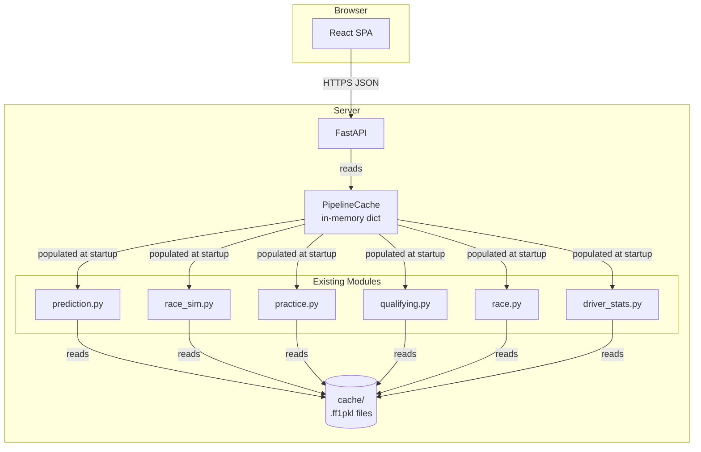

# Design Document: F1 Prediction Dashboard

## Overview

The F1 Prediction Dashboard wraps the existing Jupyter Notebook-based F1 race prediction and simulation system into a publicly hosted web application. The existing Python modules (`prediction.py`, `race_sim.py`, `practice.py`, `qualifying.py`, `race.py`, `driver_stats.py`) and cached `.ff1pkl` data for the 2022 season are preserved as-is. A new Python web backend exposes their outputs via a JSON API, and a lightweight frontend renders the results as interactive charts and tables.

The system is intentionally read-only and offline-first: all data is served from the local cache, no live FastF1 network calls are made at request time, and no user authentication is required.

**Key design decisions:**

- **FastAPI** for the backend: async-capable, auto-generates OpenAPI docs, minimal boilerplate.
- **Plotly** replaces Matplotlib/Seaborn for chart rendering: produces interactive HTML/JSON charts natively, eliminating the need to serve static image files.
- **React + Vite** for the frontend: lightweight SPA with fast initial load; served as static assets from the same FastAPI origin.
- **Pre-computation at startup**: the ML pipeline runs once per Grand Prix when the server starts, results are cached in memory. This keeps API response times well under the 10-second requirement.
- **Single-origin deployment**: FastAPI serves both the API and the built React static files, simplifying hosting (single process, single port).

---

## Architecture



**Startup sequence:**

1. FastAPI process starts.
2. `PipelineRunner` iterates over all Grand Prix directories in `cache/2022/`.
3. For each GP, it loads session data from `.ff1pkl` files via FastF1 (cache-only mode) and runs the existing analysis functions.
4. Results are stored in `PipelineCache` keyed by GP slug (e.g. `2022-03-20_Bahrain_Grand_Prix`).
5. FastAPI begins accepting requests; all responses are served from `PipelineCache`.

---

## Components and Interfaces

### Backend Components

#### `app/main.py` — FastAPI application entry point
- Mounts the React static build at `/`
- Registers API routers under `/api/v1`
- Triggers `PipelineRunner.run_all()` on startup via `lifespan` context

#### `app/pipeline/runner.py` — PipelineRunner
Orchestrates execution of the existing analysis modules for each cached GP.

```python
class PipelineRunner:
    def run_all(self) -> dict[str, GPResult]
    def run_for_gp(self, gp_slug: str) -> GPResult
```

#### `app/pipeline/cache.py` — PipelineCache
Thread-safe in-memory store for computed results.

```python
class PipelineCache:
    def set(self, gp_slug: str, result: GPResult) -> None
    def get(self, gp_slug: str) -> GPResult | None
    def list_slugs(self) -> list[str]
```

#### `app/api/routes.py` — API route handlers

| Method | Path | Description |
|--------|------|-------------|
| GET | `/api/v1/grand-prix` | List all available GP slugs and display names |
| GET | `/api/v1/grand-prix/{gp_slug}` | Full result payload for one GP |
| GET | `/api/v1/grand-prix/{gp_slug}/prediction` | ML predictions only |
| GET | `/api/v1/grand-prix/{gp_slug}/practice` | FP2 analysis only |
| GET | `/api/v1/grand-prix/{gp_slug}/qualifying` | Qualifying analysis only |
| GET | `/api/v1/grand-prix/{gp_slug}/simulation` | Race simulation only |
| GET | `/api/v1/drivers` | Driver statistics (season-wide) |

#### `app/charts/builder.py` — ChartBuilder
Converts pandas DataFrames from the existing modules into Plotly figure JSON.

```python
class ChartBuilder:
    def lap_time_distribution(self, fp2_df: DataFrame) -> dict  # Plotly JSON
    def stint_analysis(self, fp2_df: DataFrame) -> dict
    def qualifying_gap_to_pole(self, times_df: DataFrame) -> dict
    def teammate_comparison(self, h2h_df: DataFrame) -> dict
    def lap_by_lap_positions(self, sim_result: SimResult) -> dict
    def feature_importance(self, model, feature_names: list[str]) -> dict
```

### Frontend Components

```
src/
  components/
    GrandPrixSelector.tsx   # Dropdown populated from GET /api/v1/grand-prix
    PredictionPanel.tsx     # Winner, podium, model comparison table
    PracticePanel.tsx       # FP2 lap time + stint charts
    QualifyingPanel.tsx     # Gap-to-pole + teammate comparison charts
    SimulationPanel.tsx     # Lap-by-lap position chart + pit strategy table
    DriverStatsPanel.tsx    # Driver stats table
    FeatureImportancePanel.tsx  # Horizontal bar chart
    ErrorBanner.tsx         # Displays structured error messages
  App.tsx                   # Layout, GP selection state, panel routing
```

---

## Data Models

### `GPResult` (Python dataclass / Pydantic model)

```python
@dataclass
class GPResult:
    gp_slug: str
    display_name: str          # e.g. "2022 Bahrain Grand Prix"
    prediction: PredictionResult | None
    practice: PracticeResult | None
    qualifying: QualifyingResult | None
    simulation: SimulationResult | None
```

### `PredictionResult`

```python
@dataclass
class PredictionResult:
    winner: DriverPrediction
    podium: list[DriverPrediction]          # top 3
    model_used: str                         # e.g. "Random Forest"
    model_comparison: list[ModelMetrics]
    feature_importance: list[FeatureScore]  # top 10, sorted desc
```

```python
@dataclass
class DriverPrediction:
    driver_code: str    # e.g. "VER"
    win_probability: float  # rounded to 2 decimal places

@dataclass
class ModelMetrics:
    model_name: str
    accuracy: float
    precision: float
    recall: float
    f1_score: float

@dataclass
class FeatureScore:
    feature_name: str   # human-readable label
    importance: float
```

### `PracticeResult`

```python
@dataclass
class PracticeResult:
    lap_time_chart: dict        # Plotly JSON
    stint_analysis_chart: dict  # Plotly JSON
    raw_fp2_df: list[dict]      # serialized fp2_race_sim rows
```

### `QualifyingResult`

```python
@dataclass
class QualifyingResult:
    grid: list[GridEntry]
    gap_to_pole_chart: dict         # Plotly JSON
    teammate_comparison_chart: dict # Plotly JSON

@dataclass
class GridEntry:
    position: int
    driver_code: str
    best_lap_seconds: float
    q1: float | None
    q2: float | None
    q3: float | None
```

### `SimulationResult`

```python
@dataclass
class SimulationResult:
    lap_by_lap_chart: dict              # Plotly JSON
    final_classification: list[SimFinisher]
    pit_strategies: list[PitStrategy]

@dataclass
class SimFinisher:
    position: int
    driver_code: str
    gap_to_leader_seconds: float

@dataclass
class PitStrategy:
    driver_code: str
    pit_laps: list[int]
    compound_sequence: list[str]
```

### `DriverStatsResult`

```python
@dataclass
class DriverStatsResult:
    drivers: list[DriverStats]

@dataclass
class DriverStats:
    driver_code: str
    soft_avg_time_rep: float | None
    medium_avg_time_rep: float | None
    hard_avg_time_rep: float | None
    total_avg_time_rep: float | None
    total_laps_rep: int
    dnf_index: float
    home_race_advantage: bool
```

### API Error Response

```json
{
  "error": "NOT_FOUND",
  "message": "No cached data found for grand prix: 2022-99-99_Unknown_GP",
  "detail": null
}
```

```json
{
  "error": "PIPELINE_ERROR",
  "message": "ML pipeline failed for Bahrain Grand Prix",
  "detail": "ValueError: insufficient data for model training"
}
```

---

## Correctness Properties

*A property is a characteristic or behavior that should hold true across all valid executions of a system — essentially, a formal statement about what the system should do. Properties serve as the bridge between human-readable specifications and machine-verifiable correctness guarantees.*

### Property 1: Cache contents are fully reflected in the GP list

*For any* set of GP slugs stored in `PipelineCache`, a call to `GET /api/v1/grand-prix` SHALL return a list whose slugs are exactly equal to the set of slugs in the cache — no more, no fewer.

**Validates: Requirements 1.1, 7.1**

---

### Property 2: Default selection is the most recent Grand Prix

*For any* non-empty ordered list of GP slugs (sorted chronologically), the GP selected on initial dashboard load SHALL be the last element of the list.

**Validates: Requirements 1.4**

---

### Property 3: Win probability is always displayed rounded to two decimal places

*For any* floating-point win probability value in `[0.0, 1.0]`, the string rendered in the prediction panel SHALL have exactly two digits after the decimal point.

**Validates: Requirements 2.2**

---

### Property 4: Prediction panel renders all required fields

*For any* valid `PredictionResult`, the rendered `PredictionPanel` SHALL display: the predicted winner's driver code, exactly three podium entries each with a driver code and win probability, the name of the model used, and a model comparison table containing accuracy, precision, recall, and F1-score for each model in `model_comparison`.

**Validates: Requirements 2.1, 2.3, 2.4**

---

### Property 5: Practice charts contain hover data for all required fields

*For any* FP2 dataset passed to `ChartBuilder`, the resulting Plotly chart JSON SHALL contain hover template fields referencing lap number, lap time, and tyre compound for every data point.

**Validates: Requirements 3.1, 3.2, 3.3**

---

### Property 6: Gap-to-pole values are correct for all drivers

*For any* list of qualifying lap times, the gap-to-pole value computed for each driver SHALL equal that driver's best lap time minus the minimum best lap time across all drivers, and the pole-sitter's gap SHALL always be exactly 0.

**Validates: Requirements 4.1, 4.3**

---

### Property 7: Teammate comparison contains a delta for every constructor pair

*For any* qualifying dataset containing the 2022 teammate pairings defined in `constants.TEAMMATE_PAIRS_DICT`, the teammate comparison chart data SHALL contain one entry per constructor pair, each with a non-null lap time delta in milliseconds.

**Validates: Requirements 4.2**

---

### Property 8: Simulation panel renders all required data

*For any* valid `SimulationResult`, the rendered `SimulationPanel` SHALL: display a lap-by-lap position chart with one trace per driver, display a pit strategy table with pit laps and compound sequence for each driver, and display a final classification where entries are sorted by ascending position and the leader's gap to leader is exactly 0.

**Validates: Requirements 5.2, 5.3, 5.4**

---

### Property 9: Driver stats panel renders all required fields for every driver

*For any* `DriverStatsResult` containing N drivers, the rendered `DriverStatsPanel` SHALL display, for each driver: their driver code, average lap times per compound, DNF index, and home race advantage indicator — and the panel SHALL contain exactly N driver entries.

**Validates: Requirements 6.1, 6.2, 6.3**

---

### Property 10: Valid GP slug always returns a parseable JSON response

*For any* GP slug present in `PipelineCache`, a `GET /api/v1/grand-prix/{slug}` request SHALL return HTTP 200 with a JSON body that is parseable into a `GPResult` object with a matching `gp_slug` field.

**Validates: Requirements 7.2**

---

### Property 11: Unknown GP slug always returns HTTP 404 with error body

*For any* string that is not a key in `PipelineCache`, a `GET /api/v1/grand-prix/{slug}` request SHALL return HTTP 404 with a JSON body containing non-empty `error` and `message` fields.

**Validates: Requirements 7.3**

---

### Property 12: Pipeline exceptions produce structured HTTP 500 responses

*For any* exception type and message raised by `PipelineRunner`, the API SHALL return HTTP 500 with a JSON body containing the `error` field set to `"PIPELINE_ERROR"`, a non-empty `message` field, and a `detail` field containing the exception message.

**Validates: Requirements 7.6**

---

### Property 13: Feature importance chart is correctly formed

*For any* list of `FeatureScore` objects, `ChartBuilder.feature_importance()` SHALL return a Plotly chart JSON where: the number of bars equals `min(10, len(features))`, each bar label is a non-empty string matching the corresponding `feature_name`, and the bars are ordered in descending order of importance value.

**Validates: Requirements 9.1, 9.2, 9.3**

---

## Error Handling

### Backend Error Handling

| Scenario | HTTP Status | Error Code | Behavior |
|----------|-------------|------------|----------|
| Unknown GP slug | 404 | `NOT_FOUND` | Return structured JSON error |
| Pipeline exception during startup | — | — | Log error, mark GP result as unavailable; server still starts |
| Pipeline exception during request | 500 | `PIPELINE_ERROR` | Return structured JSON with exception type and message |
| Missing session data in cache | — | — | Set the relevant `GPResult` field to `None`; other sections still served |
| FastF1 attempts live network call | 500 | `PIPELINE_ERROR` | FastF1 cache-only mode raises `CacheError`; caught and returned as 500 |

### Frontend Error Handling

- Any API response with a non-2xx status renders `ErrorBanner` with the `message` field from the response body.
- If a GP result section field is `null`, the corresponding panel renders a "data unavailable" message instead of a chart.
- Network errors (fetch failure) render a generic connectivity error in `ErrorBanner`.
- The GP selector is disabled while data is loading to prevent concurrent requests.

---

## Testing Strategy

### Unit Tests (pytest)

Focus on pure functions and data transformation logic:

- `ChartBuilder` methods: verify Plotly JSON structure, field presence, sort order
- `PipelineCache`: set/get/list operations, thread safety
- `PipelineRunner.run_for_gp()`: mock FastF1 session loading, verify `GPResult` fields are populated
- API route handlers: use FastAPI `TestClient`, mock `PipelineCache`
- Data model serialization: verify `GPResult` and sub-models serialize to valid JSON

### Property-Based Tests (Hypothesis)

PBT is appropriate here because the system has pure transformation functions (chart building, probability formatting, gap calculation) and API handlers whose behavior should hold universally across all valid inputs.

Use **Hypothesis** (Python property-based testing library). Configure each test with `@settings(max_examples=100)`.

Tag format for each test: `# Feature: f1-prediction-dashboard, Property {N}: {property_text}`

Each correctness property maps to one property-based test:

| Property | Test module | Hypothesis strategy |
|----------|-------------|---------------------|
| P1: Cache list completeness | `test_api_routes.py` | `st.sets(st.text())` for GP slug sets |
| P2: Default selection | `test_frontend_logic.py` | `st.lists(st.text(), min_size=1)` sorted |
| P3: Probability formatting | `test_formatting.py` | `st.floats(min_value=0.0, max_value=1.0)` |
| P4: Prediction panel fields | `test_prediction_panel.py` | `st.builds(PredictionResult, ...)` |
| P5: Practice chart hover data | `test_chart_builder.py` | `st.dataframes(...)` with FP2 schema |
| P6: Gap-to-pole correctness | `test_chart_builder.py` | `st.lists(st.floats(min_value=60.0, max_value=120.0), min_size=1)` |
| P7: Teammate comparison deltas | `test_chart_builder.py` | `st.builds(QualifyingResult, ...)` |
| P8: Simulation panel data | `test_simulation_panel.py` | `st.builds(SimulationResult, ...)` |
| P9: Driver stats panel fields | `test_driver_stats_panel.py` | `st.lists(st.builds(DriverStats, ...), min_size=1)` |
| P10: Valid slug → 200 JSON | `test_api_routes.py` | `st.sampled_from(cache_slugs)` |
| P11: Invalid slug → 404 | `test_api_routes.py` | `st.text().filter(lambda s: s not in cache_slugs)` |
| P12: Exception → 500 | `test_api_routes.py` | `st.builds(Exception, st.text())` |
| P13: Feature importance chart | `test_chart_builder.py` | `st.lists(st.builds(FeatureScore, ...), min_size=0, max_size=20)` |

### Integration Tests

- End-to-end: start FastAPI with real cache data, call each API endpoint, verify response shape
- Verify the server starts successfully with the real `cache/` directory (smoke test)
- Verify all cached GPs are present in the `/api/v1/grand-prix` response

### Frontend Tests (Vitest + React Testing Library)

- Unit tests for each panel component with mocked API responses
- Verify `ErrorBanner` renders for null section fields
- Verify `GrandPrixSelector` populates from API response
